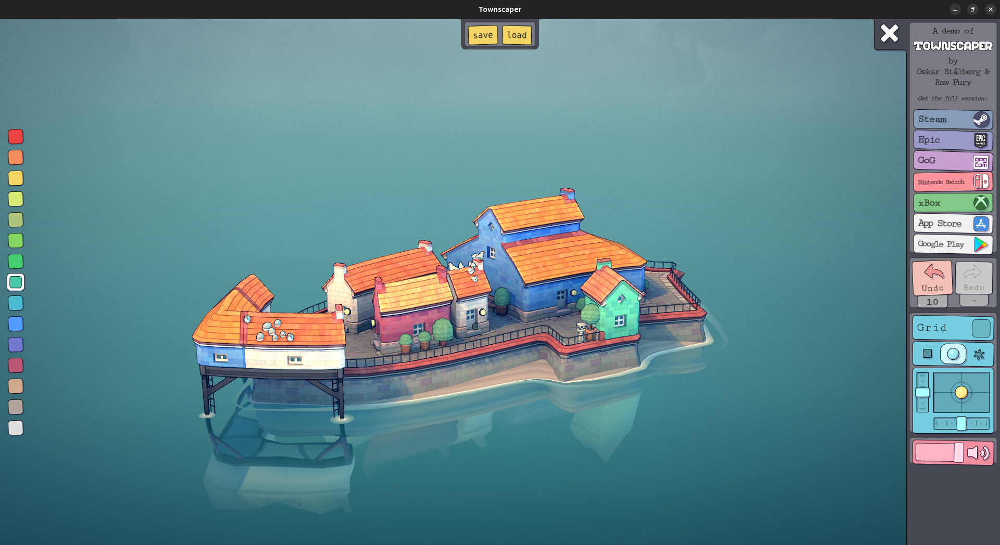

# Offline Townscaper demo

**Townscaper is a game by Oskar Stålberg. The demo is available [here](https://oskarstalberg.com/Townscaper/).**

All I did was collect the files required by the webpage. I also added a very simple load/save system to save your creations !



## How to use

Python and http.server are required for this to work because it requires creatins a http server with:

```
python3 -m http.server 8034
```

Use `start.sh` to automatically start Townscaper as an in-browser app, this only works with chromium-based browsers (for me it's brave but feel free to edit the script).

There is a template `.desktop` file if you want to add it to your apps.
